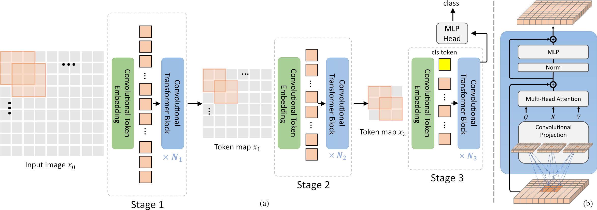

# Convolutions-Vision-Transformers

In this project, we implement the paper "[CvT: Introducing Convolutions to Vision Transformers](https://arxiv.org/abs/2103.15808)". We test the model on a [dataset of over 5000 
images from the cartoon Tom & Jerry](https://www.kaggle.com/datasets/balabaskar/tom-and-jerry-image-classification)  (classifying images based on the
 presence or absence of Tom and Jerry).



# Usage

The project can be run directly on Google Colab or locally by launching the notebook. Alternatively, it can be run using the main.py script by passing in arguments.<br>
<a target="_blank" href="https://colab.research.google.com/github/EstebanVincent/Convolutions-Vision-Transformers/blob/main/Submission.ipynb">
  
</a>

# Installation

To install the dependencies, you can run the following command:
```bash
pip install -r requirements.txt
```

# Dataset preparation

The dataset is already available in the repository, you just need to unzip it. 
But if you want to download it again, you can run the following command:
```bash
python main.py --setup --size $size
```
Where:
- size: size of the images in the dataset (default: 128)

Note that you need to have Kaggle API installed and configured to download the dataset.

# Training

To train the model, you can run the following command:
```bash
python main.py --train --model_name $model_name --n_epochs $n_epochs --batch_size $batch_size --output_dir $output_dir --lr $lr --size $size
```
Where:
- model_name: name of the model to train (default: 'cvt')
- n_epochs: number of epochs to train (default: 50)
- batch_size: batch size (default: 64)
- output_dir: directory where to save the model (default: 'models')
- lr: learning rate (default: 1e-4)
- size: size of the images in the dataset (default: 128)

# Evaluation

To evaluate the model, you can run the following command:
```bash
python main.py --evaluate --model_name $model_name --batch_size $batch_size --output_dir $output_dir --size $size
```
Where:
- model_name: name of the model to evaluate (default: 'cvt')
- batch_size: batch size (default: 64)
- output_dir: directory where is save the model (default: 'models')
- size: size of the images in the dataset (default: 128)


# Links
Paper: [CvT: Introducing Convolutions to Vision Transformers](https://arxiv.org/abs/2103.15808)<br>
Dataset: [Tom and Jerry Image classification | Kaggle](https://www.kaggle.com/datasets/balabaskar/tom-and-jerry-image-classification)

University of Rome, La Sapienza. Artificial Intelligence and Robotics. Neural Networks Course A.Y. 2022/23

Esteban Vincent | Aurélien Lurois